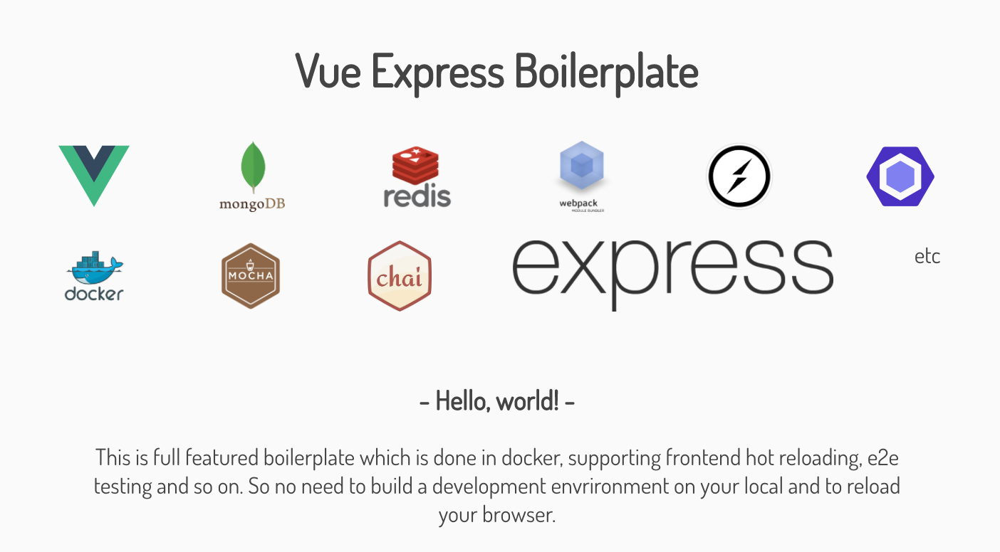

<p align="center">
  <a href="https://circleci.com/gh/RyosukeCla/vue-express-boilerplate/tree/master"></a>
  <a href="https://codeclimate.com/github/RyosukeCla/vue-express-boilerplate"></a>
  <a href="https://github.com/RyosukeCla/vue-express-boilerplate/blob/master/LICENSE"></a>
  
</p>
<p align="center">
  
</p>
<p align="center">
  
  <a href="https://github.com/nodejs/node/tree/v8.4.0"></a>
  <a href="https://github.com/npm/npm/tree/v5.3.0"></a>
  <a href="https://github.com/vuejs/vue/releases/tag/v2.4.2"></a>
  <a href="https://github.com/expressjs/express/releases/tag/4.15.4"></a>
  <a href="https://github.com/webpack/webpack/releases/tag/v3.5.6"></a>
</p>

| Common    | Frontend    | Backend     |
|:---------:|:-----------:|:-----------:|
| es2017    | vue 2.4     | express 4   |
| socket.io | vue-router 2| mongodb     |
| axios     | pug         | redis       |
| webpack 3 | scss        | nodemon     |
| eslint    | hot reload  |             |
| mocha     | nightmare   |             |
| docker    |||


## getting started
setup enviroment
```
$ git clone https://github.com/RyosukeCla/vue-express-boilerplate.git
$ cd vue-express-boilerplate
$ docker-compose up -d
$ docker-compose exec admin npm install
```
start to develop
```
$ docker-compose exec admin npm run dev
```

go to [localhost](http://localhost:8080)

## docs
- [promise.io api](./docs/promise.io.md)

# Detail
## setup
```
$ docker-compose up -d
$ docker-compose exec admin npm install
```

## develop
```
$ docker-compose exec admin npm run dev
```
go to [localhost](http://localhost:8080)

## e2e test
```
# You need to start server before e2e testing
$ docker-compose exec admin npm run dev
# or
$ docker-compose exec admin npm run start
```
```
$ docker-compose exec admin npm run test:e2e
```

## unit test
```
$ docker-compose exec admin npm run test:unit
```

## production
build for production
```
$ docker-compose exec admin npm run build
```

start server
```
$ docker-compose exec admin npm run start
```

stop server
```
$ docker-compose exec admin npm run stop
```
