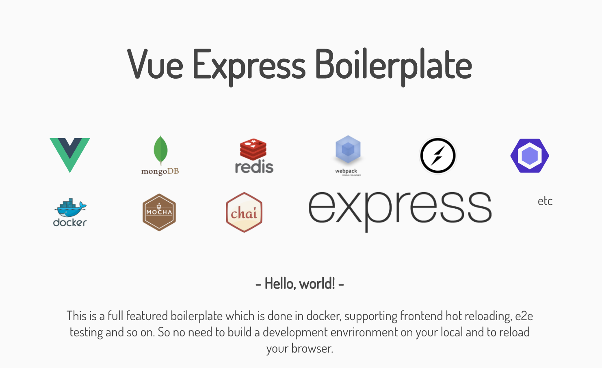

<p align="center">
  
</p>

| Common    | Frontend    | Backend     |
|:---------:|:-----------:|:-----------:|
| es2017    | vue 2.4     | express 4   |
| socket.io | vue-router 2| mongodb     |
| axios     | pug         | redis       |
| webpack 3 | scss        | nodemon     |
| eslint    | hot reload  |             |
| mocha     | nightmare   |             |
| docker    |||

## getting started
setup enviroment
```
$ git clone https://github.com/RyosukeCla/vue-express-boilerplate.git
$ cd vue-express-boilerplate
$ docker-compose up -d
$ docker-compose exec admin npm install
```
start to develop
```
$ docker-compose exec admin npm run watch
```

## docs
- [promise.io api](./docs/promise.io.md)

# Detail
## setup
```
$ docker-compose up -d
$ docker-compose exec admin bash
$ npm i
```

## develop
```
$ docker-compose exec admin bash
$ npm run dev
```

go to [localhost](localhost:8080)

## e2e test
```
$ docker-compose exec admin bash
$ npm run test:e2e
```

## unit test
```
$ docker-compose exec admin bash
$ npm run test:unit
```

## production
```
$ docker-compose exec admin bash
$ cd app
$ npm run build
```
